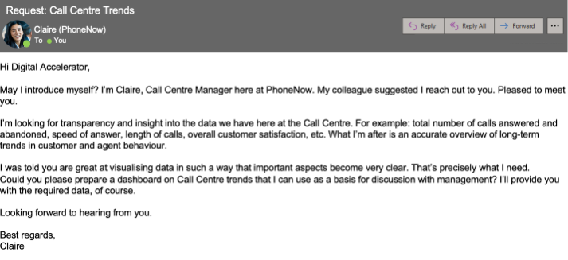

 <h1>Call Center Dashboard</h1>
    
A Power BI project for PwC showcasing key performance indicators (KPIs) to optimize call center operations. This dashboard provides insights into:

    <ul>
        <li>Overall customer satisfaction</li>
        <li>Call metrics: answered/abandoned</li>
        <li>Average speed of answer</li>
        <li>Agent performance quadrant</li>
    </ul>
    <h2>Project Overview</h2>
    
This project leverages data visualization techniques in Power BI to analyze and improve call center performance. The insights gained can help identify areas of improvement, enhance agent productivity, and boost customer satisfaction.

    <h2>Features</h2>
    <ul>
        <li>Dynamic visualization of call center KPIs</li>
        <li>Interactive agent performance analysis</li>
        <li>Real-time updates for critical metrics</li>
    </ul>
    <h2>Dashboard Preview</h2>
    <h3>Requirements</h3>
    
    <h3>Dashboard Impliment</h3>
    
    <h2>Getting Started</h2>
    
To explore the dashboard:

    <ol>
        <li>Download the Power BI file from the repository.</li>
        <li>Open it using Power BI Desktop.</li>
        <li>Connect to the dataset and refresh data as needed.</li>
    </ol>
   
